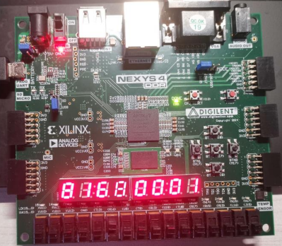

# System-Experiment-Course

这是我在同济大学系统实验课程（2020-2021）的大作业

---

## 目录
- [简介](#简介)
- [运行环境](#运行环境)
- [截图](#截图)
- [改进点](#改进点)
- [贡献](#贡献)
- [License](#License)

---

## 简介
本仓库为包含同济大学系统实验课程（2020-2021）的大作业之一。本课程共有三个大作业，其内容如下：
1. 89条指令CPU
2. 移植 ucos-II 操作系统
3. 在移植的操作系统上编写应用程序

本仓库只包含第一个大作业，该部分为基于《自己动手写CPU》的代码的改造。

因为后两个作业主要为借鉴他人的开源代码，几乎没有自己的工作，所以不在此放出，仅提供参考链接如下：[Microblaze软核实现](https://github.com/SongSenWang/Xilinx-operation-system-migration)，[手写CPU实现](https://github.com/yufeiran/OpenMIPS)

---

## 运行环境
- OS：Windows 10
- IDE：Vivado 2020.2
- 编辑器：Visual Studio Code(推荐配合插件使用)
- 编码：UTF-8

## 截图

---

## 改进点
1. 完成移植 ucos-II 操作系统及编写应用程序
2. 重构代码
3. ...

## 贡献
该仓库目前的维护者为 https://github.com/teamwong111

如有侵权或其他问题请通过邮件联系 wungjz@outlook.com

欢迎任何形式的贡献

---

## License
[MIT](https://github.com/teamwong111/System-Experiment-Course/blob/main/LICENSE)

---