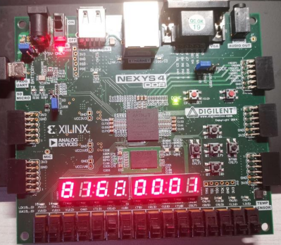

# System-Experiment-Course

[中文文档](https://github.com/teamwong111/System-Experiment-Course/blob/main/README-cn.md)

It is my term project repo of System-Experiment-Course(2020-2021) in Tongji University

---

## Contents
- [Introduction](#Introduction)
- [Running](#Running)
- [Screenshot](#Screenshot)
- [Improvement](#Improvement)
- [Contribution](#Contribution)
- [License](#License)

---

## Introduction
This repo is one of the term projects of Tongji University's System Experiment Course in 2020-2021. There are three term projects in this course, which are as follows:

1. 89 instructions' CPU
2. Transplant ucos-II operating system
3. Write the application program on the transplanted operating system

This repo only contains the first term project, which is based on the code of "Write CPU by Yourself".

Because the latter two projects are mainly for reference to other people's open source code, and almost have no change of their own, I will not put them here. Only the reference link is provided as follows: [MicroBlaze soft core implementation]( https://github.com/SongSenWang/Xilinx-operation-system-migration), [handwritten CPU implementation](https://github.com/yufeiran/OpenMIPS)

---

## Running
- OS: Windows 10
- IDE: Vivado 2020.2
- Editor: Visual Studio code(recommend to use with extensions)
- Encoding: UTF-8

---

## Screenshot

---

## Improvement
1. Complete transplanting ucos-II operating system and writing application program
2. Refactoring code

---

## Contributing
The repo is currently maintained by https://github.com/teamwong111

If I have infringement or you have any questions, please contact me by email wungjz@outlook.com

Contributions of any kind are welcome

---

## License

[MIT](https://github.com/teamwong111/System-Experiment-Course/blob/main/LICENSE)